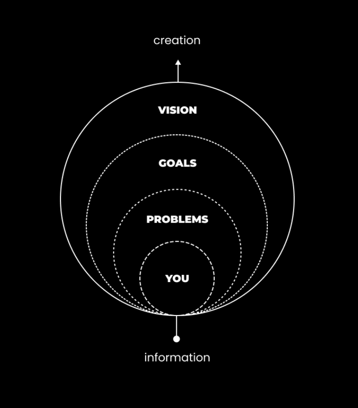

# K8s Austin Career Corner

For meetup attendees to grasp the job market in Austin as a Kubernetes skill worker

## Job Market

https://www.glassdoor.com/

https://www.fishbowlapp.com/feed

## Path to Senior Engineer

- [This GitHub repo has all the resources you need to reach Senior Software Engineer!](https://github.com/jordan-cutler/path-to-senior-engineer-handbook)

## Resume

- [resume and cover letter builder with AI](https://www.kickresume.com/en/)

## Advice

**1) Create A Lens**

As you are collecting information, ideas, and value - you need a way to apply this information to test against reality.